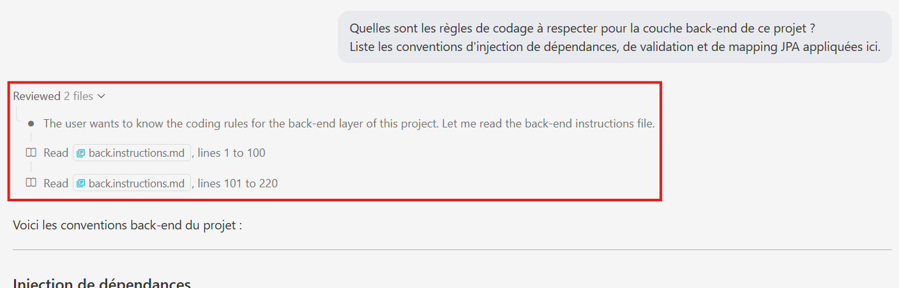

# Formation Lab IA Agentique # TP L1

Ce TP est une initiation aux différents modes et fonctionnalités de GitHub Copilot dans le cadre du développement de **[Spring PetClinic](pet-clinic.md)**, une application de référence du projet [Spring](https://spring.io/) basée sur Spring Boot MVC.

L'objectif n'est pas de livrer une implémentation complète, mais de **pratiquer chaque mode de Copilot** sur des exercices concrets, de comparer les résultats et de développer un sens critique sur les propositions générées.

## Présentation du TP

Le backlog du projet est disponible dans le dossier [backlog/](backlog/). Chaque fichier `.user-story.md` décrit une feature avec ses règles métier et sert de support aux exercices.

Points clés à garder en tête tout au long du TP :

- L'objectif est de **pratiquer Copilot**, pas de finir l'implémentation.
- Prendre le temps de **lire et critiquer** ce que Copilot propose avant de l'accepter.
- **Committer régulièrement** ses expérimentations à l'aide de la fonctionnalité Copilot Commit.

### Prérequis

1. Dézipper le projet et l'ouvrir dans VSCode.
2. Faire un `git init` pour pouvoir créer des branches et commiter.
3. Démarrer le projet : `.\mvnw.cmd spring-boot:run` (PowerShell) ou `.\mvnw spring-boot:run` (bash).

## Déroulement Pratique

### 1. Explorer le Projet


Commencer par demander à Copilot d'expliquer l'architecture générale de l'application, sans cibler une feature particulière.

```
Explique l'architecture générale de ce projet Spring Boot MVC.
Quelles sont les différentes couches architecturales et leurs interconnexions. Évalue les bonnes pratiques déjà mises en place dans le projet et à respecter.
```

### 2. Découvrir les Instructions Copilot


Ce projet embarque deux niveaux d'instructions Copilot :

- Les **Instructions Globales** : contexte projet, règles générales et conventions appliquées à toutes les conversations Copilot.
  - [.github/copilot-instructions.md](.github/copilot-instructions.md)
- Les **Instructions Contextuelles** : règles spécialisées par couche, activées automatiquement selon le contexte courant, sur la base des motifs définis dans `applyTo` et/ou d’un rapprochement sémantique avec la `description` associée.
  - [.github/instructions/back.instructions.md](.github/instructions/back.instructions.md)
  - [.github/instructions/front.instructions.md](.github/instructions/front.instructions.md)
  - [.github/instructions/database.instructions.md](.github/instructions/database.instructions.md)

L'objectif est de prendre connaissance de ces fichiers : comprendre ce qu'ils contiennent, comment leur en-tête YAML est défini, et comment vérifier qu'ils sont injectés automatiquement dans une conversation Copilot.

```
Quelles sont les règles de codage à respecter pour la couche back-end de ce projet ?
Liste les conventions d'injection de dépendances, de validation et de mapping JPA appliquées ici.
```

L'attendu est que Copilot liste des règles issues de [back.instructions.md](.github/instructions/back.instructions.md) sans que le fichier ait été cité dans le prompt, preuve que l'injection contextuelle fonctionne.

> 

### 3. Conception d'une Méthode de Contact Préféré


**Feature :** [backlog/preferred-contact-method.user-story.md](backlog/preferred-contact-method.user-story.md)

Demander à Copilot d'incarner un rôle, de proposer plusieurs approches et de comparer leurs avantages et inconvénients. Utile pour prendre une décision architecturale éclairée.

```
Tu es architecte Java/Spring sur ce projet.
Pour la feature #file:preferred-contact-method.user-story.md , compare 2 approches :
A) Validation via annotations Bean Validation sur le modèle Owner
B) Validation via un validator Spring dédié branché au controller
Pour chaque approche, donne : avantages, inconvénients, lisibilité, maintenabilité, risques de régression et impact sur les tests
Termine par une recommandation argumentée pour ce projet, avec un plan minimal en 5 étapes.
```

Nul besoin de procéder à l'implémentation de cette User Story.

### 4. Implémentation de la Welcome Page 


**Feature :** [backlog/welcome-page.user-story.md](backlog/welcome-page.user-story.md)

Avant de proposer une implémentation, demander à Copilot de poser des questions pour clarifier les besoins. Utile quand les spécifications sont floues.

```
Avant de proposer une implémentation de la Welcome Page décrite dans le backlog ( #file:welcome-page.user-story.md  ), pose-moi les questions nécessaires pour clarifier les éléments qui la composeront. Mets à jour l'US en suivant.
```

Faire l'implémentation toujours en Mode Agent, et vérifier dans l'application la page Welcome.

### 5. Implémentation de la Page des Animaux


**Feature :** [backlog/page-animaux.user-story.md](backlog/page-animaux.user-story.md)

Demander à Copilot en Mode Plan de planifier l'implémentation de l'US sur la Page des Animaux.

```
Décompose l'implémentation de la page de l'US #file:page-animaux.user-story.md en étapes atomiques.
```

Utiliser le Handoff **Start Implémentation** pour automatiquement basculer vers le Mode Agent et commencer la tâche.

### 6. Implémentation du Calendrier des RDV des Vétérinaires


**Feature :** [backlog/calendrier-rdv.user-story.md](backlog/calendrier-rdv.user-story.md)

Ce projet embarque trois **Agents** accessibles via le sélecteur de mode en haut du chat :

- **Architect** ([.github/agents/architect.agent.md](.github/agents/architect.agent.md)) : décisions architecturales, découpage de tâches. Ne produit pas de code.
- **Software Engineer** ([.github/agents/software-engineer.agent.md](.github/agents/software-engineer.agent.md)) : implémentation complète, compilable et testée.
- **Code Reviewer** ([.github/agents/code-reviewer.agent.md](.github/agents/code-reviewer.agent.md)) : revue de code, bugs, sécurité, tests manquants. Ne corrige pas directement.

#### Agent Architect : Planifier la feature

Dans un nouveau chat, sélectionner l'agent **Architect**, puis :

```
Tu es architecte sur ce projet.
Décompose l'implémentation de la feature #file:calendrier-rdv.user-story.md en tâches atomiques et ordonnées.
Pour chaque tâche, précise : la couche impactée, les fichiers à créer ou modifier, les risques identifiés.
Termine par les critères d'acceptance techniques que le développeur devra valider.
```

#### Agent Software Engineer : Implémenter

Sélectionner l'agent **Software Engineer**, puis :

```
Implémente la feature #file:calendrier-rdv.user-story.md dans ce projet Spring Boot MVC en suivant le plan de l'architecte.
Respecte les patterns existants du projet documentés dans #file:back.instructions.md et #file:front.instructions.md .
```

> [!IMPORTANT]
> **Biais de confirmation** : un agent qui a produit du code aura tendance à valider sa propre production lors de la revue. Pour éviter ce biais, **ouvrir une nouvelle conversation** entre chaque agent.

#### Agent Code Reviewer : Réviser

Dans une **nouvelle conversation**, sélectionner l'agent **Code Reviewer**, puis soumettre le code produit :

```
Révise le code qui vient d'être produit pour la feature #file:calendrier-rdv.user-story.md .
Liste par ordre de criticité : les incohérences avec les règles métier, les validations manquantes, les oublis de tests et les risques de sécurité (OWASP Top 10).
Ne corrige pas : liste uniquement les observations.
```

### 7. Stratégie Zero / One / Few Shots : Extraction d'une Note d'Accueil


**Mise en situation :** L'agent d'accueil de la clinique prend des notes au fil de l'eau pendant les appels téléphoniques. Pour lui faire gagner du temps, on souhaite à terme que ces notes soient automatiquement converties en JSON afin de pré-remplir le formulaire de création d'une `Visit`. Avant d'industrialiser quoi que ce soit dans le code, on cherche d'abord à valider par le prompt qu'un LLM peut produire un JSON exploitable et conforme aux conventions du domaine (`Owner`, `Pet`, `Visit`).

Fournir des exemples dans un prompt ne sert pas qu'à fixer un format : c'est aussi le moyen le plus court de transmettre une **politique métier tacite** (cas particuliers, valeurs par défaut) que les instructions textuelles peinent à décrire. Plus les exemples couvrent d'edge-cases, plus le modèle généralise la bonne règle. Lancer successivement les trois prompts ci-dessous sur le même jeu de notes et comparer les sorties.

**Zero Shot (aucun cadrage) :**

```
Convertis ces notes d'accueil en JSON pour créer une visite vétérinaire :
1. "Mme Dupont rappelle pour Minou, vaccin demain 14h."
2. "M. Martin amène Rex et Bella vendredi pour le contrôle annuel."
3. "Un monsieur arrive avec un chat blessé, pas dans le système, à passer en urgence."
```

**One Shot (un exemple cadre le schéma) :**

```
Convertis ces notes d'accueil en JSON pour créer une visite vétérinaire, en suivant le format de l'exemple.

Exemple :
Note : "Mme Leroy appelle pour Caramel, détartrage lundi 10h."
JSON : { "ownerLastName": "Leroy", "petName": "Caramel", "visitType": "DETARTRAGE", "scheduledAt": "2026-05-04T10:00", "notes": null }

Notes à convertir :
1. "Mme Dupont rappelle pour Minou, vaccin demain 14h."
2. "M. Martin amène Rex et Bella vendredi pour le contrôle annuel."
3. "Un monsieur arrive avec un chat blessé, pas dans le système, à passer en urgence."
```

**Few Shots (trois exemples encodent la politique métier) :**

```
Convertis ces notes d'accueil en JSON pour créer une visite vétérinaire, en suivant le format des exemples.

Exemple 1 (cas nominal) :
Note : "Mme Leroy appelle pour Caramel, détartrage lundi 10h."
JSON : { "ownerLastName": "Leroy", "pets": ["Caramel"], "visitType": "DETARTRAGE", "scheduledAt": "2026-05-04T10:00", "priority": "NORMAL", "needsOwnerLookup": false, "notes": null }

Exemple 2 (heure absente, plusieurs animaux) :
Note : "Famille Petit, Snoopy et Garfield, rappel vaccins jeudi."
JSON : { "ownerLastName": "Petit", "pets": ["Snoopy", "Garfield"], "visitType": "VACCIN", "scheduledAt": "2026-05-07", "priority": "NORMAL", "needsOwnerLookup": false, "notes": null }

Exemple 3 (propriétaire inconnu, urgence) :
Note : "Quelqu'un débarque avec un chien qui boite, jamais vu, à caser tout de suite."
JSON : { "ownerLastName": null, "pets": [null], "visitType": "URGENCE", "scheduledAt": "2026-04-30T09:00", "priority": "URGENT", "needsOwnerLookup": true, "notes": "chien qui boite, propriétaire à enregistrer" }

Notes à convertir :
1. "Mme Dupont rappelle pour Minou, vaccin demain 14h."
2. "M. Martin amène Rex et Bella vendredi pour le contrôle annuel."
3. "Un monsieur arrive avec un chat blessé, pas dans le système, à passer en urgence."
```

### 8. Skills : Connaissances Métier Injectées à la Demande


Ce projet embarque deux **Skills** :

- [.github/skills/generate-tests/SKILL.md](.github/skills/generate-tests/SKILL.md) : conventions JUnit pour ce projet
- [.github/skills/conventional-commit/SKILL.md](.github/skills/conventional-commit/SKILL.md) : format Conventional Commits

Un skill s'active selon la tâche demandée par une correspondance sémantique sur le champ `description`. Le skill n'a jamais besoin d'être cité dans le prompt : Copilot l'injecte dès qu'il reconnaît que la demande correspond à son domaine.

#### Génération de tests (skill `generate-tests`)

`VetControllerTests` ne couvre actuellement que deux cas : la liste HTML (`GET /vets.html`) et l'endpoint JSON (`GET /vets`). Dans un chat Agent, demander :

```
Génère les tests manquants pour VetController.
```

#### Commit conventionnel (skill `conventional-commit`)

Stager les modifications produites pendant cet exercice, puis dans un chat Agent :

```
Génère un message de commit pour les changements stagés.
```

### 9. Model Context Protocol (MCP)


Le **Model Context Protocol (MCP)** est un protocole ouvert qui permet à Copilot d'invoquer des outils exposés par des serveurs externes.

> [!IMPORTANT]
> Ce projet embarque son propre serveur MCP qui expose les données PetClinic (propriétaires, animaux, vétérinaires) directement depuis l'application Spring Boot. Il faut donc **démarrer l'application**.

L'utilisation de serveurs MCP se configure localement dans [.vscode/mcp.json](.vscode/mcp.json). Configurer l'IDE pour qu'il découvre l'existence du serveur MCP :

```json
{
  "servers": {
    "petclinic": {
      "type": "sse",
      "url": "http://localhost:8080/sse"
    }
  }
}
```

Ouvrir la palette de commandes (`Ctrl+Shift+P`) → **MCP: List Servers** → sélectionner `petclinic` → **Start Server**. Vérifier que le statut passe à `Running`.

Demander d'abord à Copilot de lister les fonctionnalités disponibles :

```
Quels outils me propose le serveur MCP petclinic ?
```

Puis utiliser un des outils listés, par exemple :

```
Combien y a-t-il de propriétaires dans la clinique ?
```